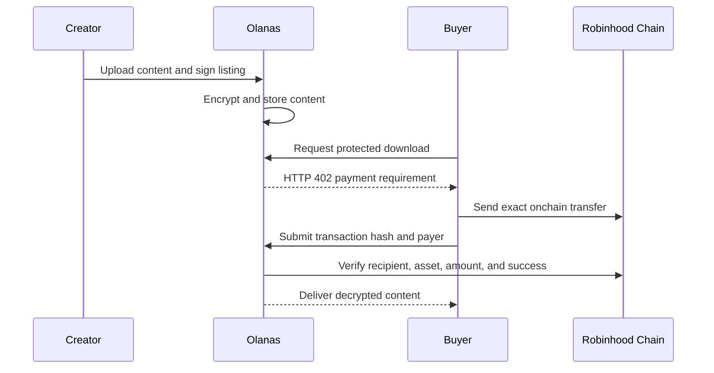

The current Olanas application is a non-custodial-style content paywall: buyers transfer funds directly to the creator address specified by the listing, and the server verifies the transaction before delivering content.

## Payment lifecycle

## Verification rules

- The network must match the listing requirement.
- The transaction must be successfully mined.
- Native transfers are checked against the recipient and value.
- ERC-20 transfers are checked through the configured token contract's `Transfer` event.
- The payer, recipient, currency, and exact amount must match.
- A payment proof cannot purchase a different requirement.

## Custody and fees

The current implementation sends payments directly to creators. It reports a facilitator fee of zero and does not submit transfers for buyers.

<Info>
  This application uses a custom payment proof around HTTP status `402`. Compatibility with another x402 implementation should not be assumed.
</Info>

## Content storage

Uploaded content is encrypted before local persistence. Optional IPFS pinning uploads ciphertext, not plaintext. Operators must back up the encrypted data and the configured vault secret together.
