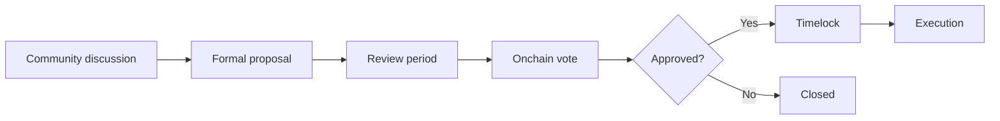

<Info>
  **Status: no token governance process is documented as active.** Do not rely on unofficial votes or proposals.
</Info>

## Before governance launches

Olanas should publish:

- who can create proposals;
- which decisions are in and out of scope;
- proposal, voting, quorum, and approval thresholds;
- voting-power calculation and delegation rules;
- timelock and emergency-cancellation controls;
- the execution process and responsible contracts;
- conflict-of-interest and treasury policies; and
- a clear transition path from team-led to community-led decisions.

## Suggested proposal lifecycle

## Governance safety

High-impact actions should use transparent onchain execution, a published timelock, and a multisig or equivalent safeguard. Emergency powers should be narrow, observable, and time-limited.
